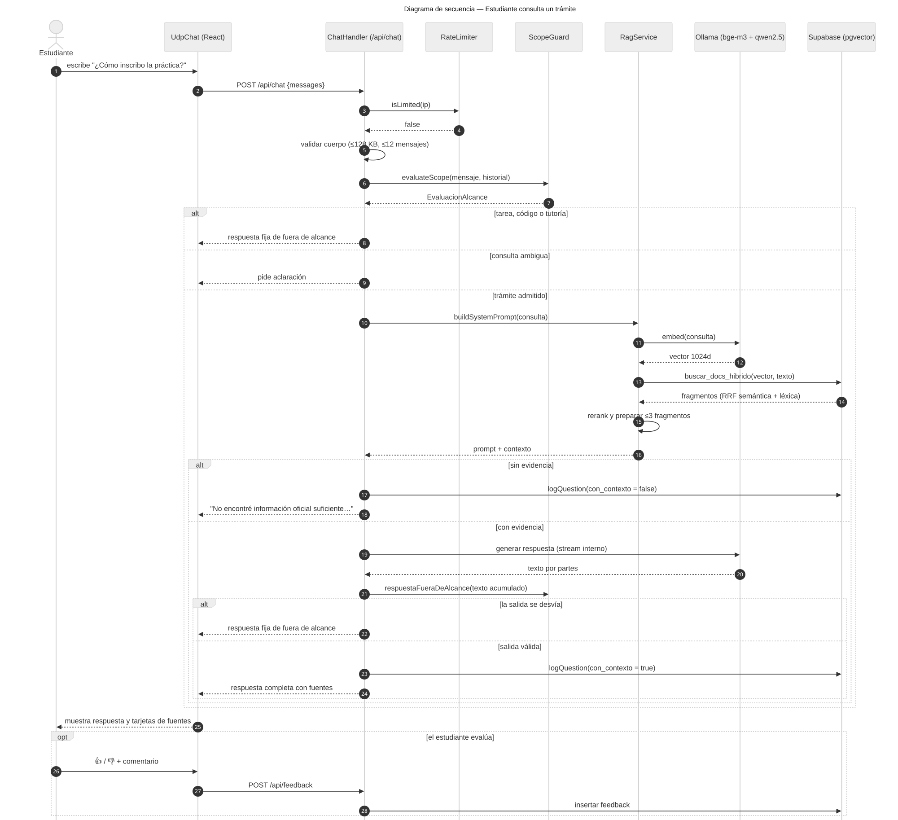

# Asistente EIT UDP: documentación de ingeniería de software

Documento para la revisión de la DTI. Describe qué hace el sistema, cómo está construido y qué requisitos de calidad cumple. Todo lo que dice corresponde al código del repositorio al 23-09-2026. Lo que todavía no está medido se marca como **pendiente**.

**Autor:** Víctor Barrera · **Estado:** piloto en el servidor leo (Dokku), en proceso de oficialización con la Escuela de Informática y Telecomunicaciones.

## 1. Qué es

El Asistente EIT es un chatbot institucional que orienta a estudiantes y postulantes en **trámites y servicios** de la Escuela: prácticas, titulación, toma de ramos, reglamentos, ayudantías, bienestar estudiantil y admisión. Responde **solo con información recuperada de sitios oficiales de la UDP** (arquitectura RAG) y cita las fuentes. Si no encuentra respaldo, se abstiene. No entrega tutorías, código ni soluciones de tareas.

## 2. Diagramas

Las fuentes de los diagramas están en `docs/uml/*.mmd` (Mermaid) y se regeneran con:

```bash
npx -y @mermaid-js/mermaid-cli -i docs/uml/01-clases.mmd -o docs/uml/01-clases.svg -c docs/uml/config.json -b white
```

### 2.1 Diagrama de clases



El código está organizado en **módulos JavaScript** (`api/_lib/*.js`), no en clases. Este diagrama es el **modelo lógico**: cada módulo aparece como la clase que representa, con sus funciones públicas como métodos. Las entidades de datos (`Fragmento`, `PreguntaLog`, `Feedback`, `AvisoUrgente`, `RegistroPagina`, `VersionPagina`) corresponden a tablas de PostgreSQL.

Relaciones destacadas:

- **Realización de interfaz.** `OllamaProvider` (producción, on-premise) y `GeminiProvider` (demo) implementan el mismo contrato `ProveedorIA`. Así se puede cambiar de proveedor sin tocar el resto del sistema.
- **Composición.** Una `Pagina` se divide en uno o más `Fragmento`. Si la página deja de existir, sus fragmentos se eliminan con ella (por eso el rombo relleno). Lo mismo ocurre con su registro de ingesta y su historial.
- **Dependencias.** `ChatHandler` no conoce a los proveedores de IA: solo habla con `ScopeGuard` y `RagService`.

### 2.2 Diagrama de secuencia: el estudiante consulta un trámite



El diagrama muestra las **cuatro salidas posibles** de una consulta:

1. **Rechazo fijo** para tareas, código o tutorías. Se decide sin llamar a ninguna IA.
2. **Pedido de aclaración** cuando la consulta es ambigua.
3. **Abstención** cuando la búsqueda no encuentra evidencia oficial.
4. **Respuesta con fuentes**, solo después de verificar que el texto generado completo no se salió del alcance.

El texto generado **nunca se muestra a medias**. Se valida completo antes de publicarlo.

### 2.3 Diagrama de actividades: ingesta incremental del corpus



El scraper se ejecuta cada día en una VM dedicada. Garantiza tres cosas:

- **Incremental.** Una página sin cambios (HTTP 304 o mismo hash de contenido) no se vuelve a procesar.
- **Atómico.** Los fragmentos nuevos se insertan bajo un `batch_id`. La versión anterior se borra solo cuando la nueva quedó completa y verificada. Si algo falla, se revierte y el asistente sigue usando la versión anterior.
- **Auditable.** Cada versión distinta de cada página queda en `eit_paginas_historial` y como snapshot HTML en disco.

### 2.4 Diagrama de despliegue



| Nodo | Rol | Software |
| --- | --- | --- |
| Servidor **leo** | Atiende a los estudiantes | Dokku, Nginx, Node.js 22 (Nitro + TanStack Start), Ollama con GPU (`qwen2.5:7b`, `bge-m3`) |
| **VM de ingesta** | Scraping, evaluación, purga de datos | Ubuntu 26.04, Node.js, Ollama en CPU (`bge-m3`), systemd timers |
| **Supabase** | Base de datos y búsqueda vectorial | PostgreSQL + pgvector, PostgREST |
| **GitLab** | Integración y despliegue continuo | CI: TypeScript, pruebas y build, con despliegue automático a Dokku desde `main` |

## 3. Historias de usuario

Formato: *Como [rol], quiero [acción] para [beneficio]*. Los criterios de aceptación usan *Dado / Cuando / Entonces*. Prioridad MoSCoW: **M** = debe, **S** = debería, **C** = podría.

### Estudiante

**HU-01 · Consultar un trámite (M)**
Como estudiante de la EIT, quiero preguntar en lenguaje natural cómo se hace un trámite (por ejemplo, "¿cómo inscribo la práctica?") para no tener que buscar entre varios sitios de la universidad.

- *Dado* que pregunto por un trámite cubierto por los sitios oficiales, *cuando* envío la consulta, *entonces* recibo una respuesta en español basada en esos documentos.
- *Entonces* la respuesta muestra tarjetas con los enlaces a las fuentes oficiales usadas.

**HU-02 · Saber de dónde sale la respuesta (M)**
Como estudiante, quiero ver las fuentes de cada respuesta para verificarla y no depender solo del chatbot.

- *Dado* una respuesta con evidencia, *entonces* incluye al menos un enlace a un sitio `*.udp.cl`.

**HU-03 · Que no me inventen información (M)**
Como estudiante, quiero que el asistente me diga cuando no sabe algo, en vez de inventar un requisito o un plazo.

- *Dado* una consulta sin documentos oficiales relevantes, *cuando* la envío, *entonces* el asistente responde que no encontró información suficiente y me remite a `eit.udp.cl`, sin generar texto con IA.

**HU-04 · Preguntar como hablo (S)**
Como estudiante, quiero usar expresiones coloquiales ("echarme un ramo", "la profe", "botar un ramo") y que igual me entienda.

- *Dado* una consulta coloquial sin resultados, *cuando* se busca, *entonces* se reformula a lenguaje institucional y se repite la búsqueda.

**HU-05 · Buscar por sigla o código (S)**
Como estudiante, quiero preguntar por siglas o nombres exactos (TNE, DAE, UDPiler, IEEE) y que el asistente encuentre la página correcta.

- *Dado* una consulta con un término exacto, *entonces* la búsqueda combina similitud semántica y coincidencia textual (búsqueda híbrida).

**HU-06 · Continuar la conversación (S)**
Como estudiante, quiero hacer una pregunta de seguimiento ("¿y qué documentos necesito?") sin repetir todo el contexto.

- *Dado* una consulta admitida anterior, *cuando* hago un seguimiento, *entonces* se interpreta en relación con esa consulta y no con respuestas previas del asistente.

**HU-07 · Evaluar una respuesta (S)**
Como estudiante, quiero marcar una respuesta con 👍 o 👎 y dejar un comentario para que el asistente mejore.

- *Entonces* la evaluación queda registrada y aparece en el panel de administración.

**HU-08 · Recibir un límite claro de alcance (M)**
Como estudiante, quiero que el asistente me diga con claridad que no resuelve tareas, en lugar de una respuesta confusa.

- *Dado* que pido código, un informe o la solución de un ejercicio, *entonces* recibo un mensaje fijo que explica el alcance y a quién acudir, sin que se genere contenido con IA.

**HU-09 · Usar el asistente desde el sitio de la Escuela (C)**
Como estudiante, quiero abrir el asistente desde una página de `eit.udp.cl` sin cambiar de sitio.

- *Dado* el widget embebido en un dominio `*.udp.cl`, *entonces* funciona dentro del iframe. En dominios ajenos a la UDP, el navegador bloquea el embebido.

### Postulante

**HU-10 · Conocer requisitos de ingreso (S)**
Como postulante, quiero saber la duración, el título y las ponderaciones PAES de ICIT o CDAI para decidir mi postulación.

- *Entonces* la respuesta se basa en las fichas de `admision.udp.cl` y cita la ficha correspondiente.

### Administración de la Escuela

**HU-11 · Ver cómo se usa el asistente (M)**
Como administrador de la Escuela, quiero un panel con el volumen de preguntas, las más frecuentes, la satisfacción y el feedback negativo para detectar problemas.

- *Dado* que inicio sesión en `/admin` con la contraseña, *entonces* veo uso diario, preguntas frecuentes, tasa de satisfacción y comentarios negativos recientes.
- *Dado* 5 intentos fallidos en 5 minutos, *entonces* el login se bloquea temporalmente.

**HU-12 · Detectar vacíos de información (S)**
Como administrador, quiero ver las preguntas que el asistente no pudo responder por falta de documentos para publicar o corregir esa información en los sitios oficiales.

- *Entonces* el panel lista las preguntas registradas sin contexto ("brechas de cobertura").

**HU-13 · Publicar un aviso urgente (C)**
Como administrador, quiero publicar un aviso temporal (por ejemplo, un cambio de plazo) para que el asistente lo considere de inmediato.

- *Dado* un aviso activo en `avisos_urgentes` con fecha de vigencia, *entonces* se incluye en el contexto de las respuestas hasta que vence.
- **Pendiente:** hoy se crea directamente en la base de datos. Falta un formulario en el panel.

### DTI / operación

**HU-14 · Apagar la IA sin apagar el servicio (M)**
Como encargado de sistemas, quiero desactivar la generación con IA ante un incidente sin sacar el asistente de línea.

- *Dado* `CHAT_RESPONSE_MODE=static`, *entonces* ninguna consulta llega al modelo y el asistente entrega solo orientación fija.

**HU-15 · Mantener el corpus actualizado sin intervención (M)**
Como encargado de sistemas, quiero que la información se actualice sola cada día y que un fallo no deje al asistente sin datos.

- *Dado* el timer diario, *entonces* solo se reprocesan las páginas que cambiaron.
- *Dado* un fallo a mitad de la ingesta, *entonces* la versión anterior de la página se conserva.

**HU-16 · Controlar la retención de datos (S)**
Como encargado de sistemas, quiero que las preguntas y el feedback de estudiantes se borren después de un plazo definido.

- *Dado* `DATA_RETENTION_DAYS`, *entonces* la purga semanal elimina los registros más antiguos que ese plazo.

## 4. Requerimientos no funcionales

Clasificados según ISO/IEC 25010. La columna **Verificación** indica cómo se comprueba cada uno. **Pendiente** significa que es un objetivo que todavía no se ha medido.

### Seguridad

| ID | Requerimiento | Criterio medible | Verificación |
| --- | --- | --- | --- |
| RNF-SEG-01 | Limitar el abuso del chat | 20 mensajes cada 5 min por IP (configurable). Máximo 4 generaciones simultáneas contra la GPU, 2 por cliente. La IP sale del socket; las cabeceras de proxy solo se aceptan desde redes de confianza, e IPv6 se agrupa por /64. | `rate-limit.test.js`, `chat-containment.test.js` |
| RNF-SEG-02 | Rechazar cuerpos grandes o malformados | ≤128 KB, contados byte a byte (también en peticiones chunked). Solo `application/json` con un objeto. 413, 415 o 400 en caso contrario. | `http-body.test.js` |
| RNF-SEG-03 | Proteger el panel de administración | Contraseña de 12+ caracteres con 3 tipos de carácter. Sesión HMAC-SHA256 HttpOnly de 8 h. 5 intentos cada 5 min. Verificación de Origin. Revocación masiva con `SESSION_NOT_BEFORE`. | `admin-security.test.js` |
| RNF-SEG-04 | Secretos robustos | `ADMIN_SESSION_SECRET` y `CRON_SECRET` de 32+ caracteres. Si no los cumplen, el sistema no arranca esas funciones (fail-closed). | `admin-security.test.js` |
| RNF-SEG-05 | Cabeceras HTTP de seguridad | Páginas con CSP con nonce por petición (`script-src 'self' 'nonce-…'`, `connect-src 'self'`). HSTS, `nosniff`, Referrer-Policy y Permissions-Policy en todo el sitio. En `/api/*`: CSP `default-src 'none'` y `X-Frame-Options: DENY`. El widget solo se puede embeber desde `*.udp.cl`. | `src/server.ts`. Verificado en navegador: XSS inline y exfiltración bloqueados. |
| RNF-SEG-06 | Resistencia a inyección de instrucciones | El texto oculto (CSS, `aria-hidden`, comentarios) se elimina antes de indexar. Los documentos entran al prompt como datos JSON, no como instrucciones. | `scrape.js`, `rag.js` |
| RNF-SEG-08 | Enlaces confiables en las respuestas | Solo se publican URLs de `*.udp.cl` o presentes en la evidencia recuperada. | `output-links.test.js` |
| RNF-SEG-09 | Scraper sin SSRF | Cada redirección se valida contra `*.udp.cl` antes de seguirla. | `scrape-incremental.test.js` |
| RNF-SEG-10 | Datos cerrados al público | RLS sin políticas y privilegios solo para `service_role` en todas las tablas y funciones. | `006_rls_y_privilegios.sql` |
| RNF-SEG-07 | Mínimo privilegio en la ingesta | El scraper corre como usuario de sistema sin shell, con `ProtectSystem=strict`, y solo escribe en su directorio de datos. | `deploy/scraper/*.service` |

### Confiabilidad de las respuestas

| ID | Requerimiento | Criterio medible | Verificación |
| --- | --- | --- | --- |
| RNF-CON-01 | Respetar el alcance | 40/40 casos del contrato de alcance clasificados correctamente (conjunto de desarrollo). | `npm run test:scope` |
| RNF-CON-02 | Abstenerse sin evidencia | 0 generaciones con IA cuando no hay fragmentos recuperados. | `chat-containment.test.js` |
| RNF-CON-03 | Recuperar la página correcta | Objetivo: hit@5 ≥ 80 % sobre el conjunto de evaluación. | `npm run eval:retrieval` (**pendiente** de correr contra producción; el conjunto de 200 consultas validado por la Escuela también está pendiente) |

### Disponibilidad y tolerancia a fallos

| ID | Requerimiento | Criterio medible | Verificación |
| --- | --- | --- | --- |
| RNF-DIS-01 | La ingesta no deja al asistente sin datos | Cambio atómico por URL con verificación de conteo y rollback. | `scrape-incremental.test.js` |
| RNF-DIS-02 | Degradación controlada | Si el proveedor de IA falla, se responde 502 con un mensaje claro. Si hay saturación, 503. Nunca se publica una respuesta parcial. | `chat-containment.test.js` |
| RNF-DIS-03 | Independencia entre ingesta y atención | Una caída de la VM de ingesta no afecta al chat. | Diagrama de despliegue |
| RNF-DIS-04 | Disponibilidad del servicio | Objetivo: 99 % mensual en horario académico. | **Pendiente**: requiere monitoreo externo |

### Rendimiento

| ID | Requerimiento | Criterio medible | Verificación |
| --- | --- | --- | --- |
| RNF-REN-01 | Tiempo de respuesta | Objetivo: p95 ≤ 10 s por respuesta completa con GPU. Los rechazos y aclaraciones responden en < 100 ms (sin IA). | **Pendiente** de medir en leo |
| RNF-REN-02 | Tiempos máximos de dependencias | Búsqueda 5 s, embeddings 30 s, avisos 3 s. Ninguna llamada externa queda sin timeout. | `rag.js` |
| RNF-REN-03 | Ingesta eficiente | Las páginas sin cambios no consumen embeddings. | `scrape-incremental.test.js` |

### Mantenibilidad

| ID | Requerimiento | Criterio medible | Verificación |
| --- | --- | --- | --- |
| RNF-MAN-01 | Calidad verificada en cada cambio | CI con `tsc --noEmit`, 233 pruebas automatizadas y build. Si algo falla, no se despliega. | `.gitlab-ci.yml` |
| RNF-MAN-02 | Lógica independiente de la plataforma | La lógica de negocio vive en `api/_lib/` y los adaptadores de Dokku y Vercel solo traducen HTTP. | Estructura del repositorio |
| RNF-MAN-03 | Agregar fuentes sin tocar código de lógica | Una página nueva es una entrada en `PAGES`. | `scrape.js` |
| RNF-MAN-04 | Cambios de esquema reversibles | Las migraciones SQL son aditivas y el código funciona antes y después de aplicarlas. | `scripts/migrations/` |

### Privacidad

| ID | Requerimiento | Criterio medible | Verificación |
| --- | --- | --- | --- |
| RNF-PRI-01 | Minimización | Sin cuentas ni identificadores. Preguntas truncadas a 500 caracteres. Las consultas rechazadas no se registran. | `docs/privacidad-y-retencion.md` |
| RNF-PRI-02 | Retención limitada | Purga semanal de lo anterior a `DATA_RETENTION_DAYS` (180 días provisorios, mínimo 30). | `scripts/purge-old-data.js` |
| RNF-PRI-03 | Inferencia en infraestructura UDP | En producción, las preguntas se procesan con Ollama en leo, no en APIs de terceros. | `AI_PROVIDER=ollama` |

### Usabilidad y portabilidad

| ID | Requerimiento | Criterio medible | Verificación |
| --- | --- | --- | --- |
| RNF-USA-01 | Uso en móvil | Interfaz usable desde 360 px de ancho. | **Pendiente** de revisión formal |
| RNF-USA-02 | Accesibilidad | Objetivo: WCAG 2.2 AA en contraste, foco visible y navegación por teclado. | **Pendiente** de auditoría |
| RNF-POR-01 | Portabilidad del despliegue | El mismo build corre en Dokku (node-server) y en Vercel. El proveedor de IA se elige por variable de entorno. | `vite.config.ts`, `rag.js` |

## 5. Trazabilidad

| Historia | Requerimientos relacionados | Evidencia |
| --- | --- | --- |
| HU-01, HU-02 | RNF-CON-03, RNF-REN-01 | `rag.js`, `eval-retrieval.js` |
| HU-03 | RNF-CON-02 | `chat-containment.test.js` |
| HU-05 | RNF-CON-03 | `005_busqueda_hibrida.sql`, `rag-hybrid.test.js` |
| HU-08 | RNF-CON-01 | `scope-contract.test.js` |
| HU-11 | RNF-SEG-03, RNF-SEG-04 | `admin-security.test.js` |
| HU-14 | RNF-DIS-02 | `CHAT_RESPONSE_MODE` |
| HU-15 | RNF-DIS-01, RNF-REN-03 | `scrape-incremental.test.js` |
| HU-16 | RNF-PRI-02 | `purge-old-data.js` |
