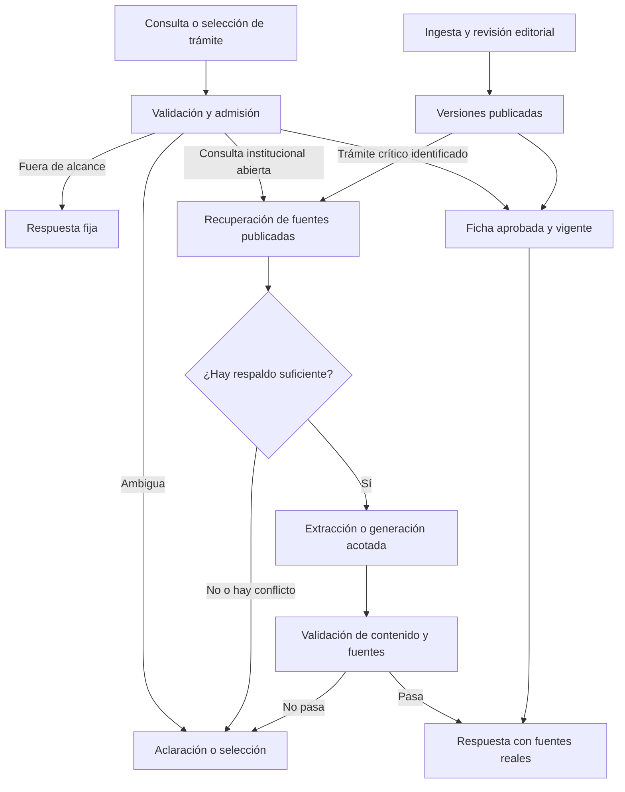

# Plan integral del Asistente EIT UDP

Estado: propuesta para revisar por etapas; no autoriza todavía implementaciones ni despliegues.

Fecha: 7 de septiembre de 2026. Checkout revisado: `/Users/victor/asistente-udp/bot_asistencia_udp`, rama `main`, HEAD `e789e20`.

## 1. Decisión principal

El objetivo debe ser que el sistema entregue información institucional útil, respaldada y vigente, y que se abstenga cuando no pueda hacerlo. La calidad del modelo es una pieza de ese objetivo. También importan qué preguntas se admiten, qué documentos se recuperan, cómo se publican esos documentos, cómo se valida una respuesta y qué ve el estudiante ante un error.

Recomiendo una arquitectura híbrida: respuestas aprobadas para trámites críticos, búsqueda documental para consultas abiertas del ámbito institucional y generación opcional con evidencia. El sistema debe poder funcionar en modo estricto, sin generación libre, durante incidentes o cuando no se haya validado una categoría.

No existe garantía general de cero alucinaciones con generación libre. Un catálogo de respuestas aprobadas evita la invención generativa en esa ruta; todavía exige elegir la ficha correcta y mantener sus datos vigentes. Un segundo modelo que juzgue la respuesta reduce algunos riesgos, pero también puede equivocarse.

## 2. Qué se verificó y qué falta

Se inspeccionaron los módulos de aplicación, frontend principal y widget, adaptadores HTTP, configuración, prompt, filtros, recuperación, scraper, SQL, feedback, administración, pruebas y CI/CD. La revisión anterior del mismo trabajo se encuentra en `revision-alcance-2026-09-07.md`.

Se ejecutaron pruebas locales con `fetch` simulado, sin enviar mensajes a Ollama, Supabase o Google Forms reales. Se verificó solo presencia/ausencia de variables en los archivos de entorno; no se mostraron valores. Las variables locales no prueban la configuración del servidor institucional.

- Tipado y build: aprobados en la intervención anterior; siete declaraciones nuevas permanecen como archivos sin commit.
- Suite existente: 101 pruebas aprobadas en la intervención anterior. No son pruebas de exactitud del Qwen desplegado.
- Lint ampliado actual: `npx eslint src api scripts vite.config.ts --format json` reportó 14 errores y 6 advertencias. Doce errores son de formato y dos son escapes innecesarios. La configuración necesita reglas semánticas explícitas para el backend JavaScript; no basta con que Prettier lo revise.
- `npm audit --omit=dev` no pudo consultar el registro: `ENOTFOUND registry.npmjs.org`. No se concluye que las dependencias estén libres de vulnerabilidades.
- Pendiente: commit y configuración desplegados, GPU/VRAM/RAM, carga esperada, versión/digest de modelos, políticas y contenido real de Supabase, TLS/proxy, backups y cron de Dokku. Tampoco se realizó una auditoría visual/interactiva de accesibilidad en este turno.

## 3. Inventario y decisión propuesta por componente

Las versiones siguientes son las instaladas según `package-lock.json`, no una recomendación de versión mínima o más reciente.

| Componente actual | Decisión inicial | Cambio o condición de reemplazo |
| --- | --- | --- |
| React 19.2.6, Tailwind, Vite 7.3.3 | Conservar | Mejorar accesibilidad, estados, fuentes e historial. Un rediseño total no resuelve la exactitud del asistente. |
| TanStack Start 1.168.16, Router 1.170.9 | Conservar, probar compatibilidad | Consolidar contratos y lógica duplicada. Evaluar React SPA + API si SSR deja de aportar y simplificar operación compensa la migración. |
| Nitro 3.0.260429-beta | Revisar como riesgo operativo | Es una versión beta fijada. Evaluar una combinación estable compatible en una rama y entorno de pruebas, sin actualizar piezas aisladas a ciegas. |
| Backend JavaScript compartido en `api/_lib` | Migrar gradualmente a TypeScript | Empezar por resultados del chat, esquema de documentos, estados de recuperación y configuración. Las declaraciones actuales no verifican el interior del JavaScript. |
| Ollama + Qwen2.5 7B por defecto | Mantener como referencia de evaluación | Confirmar modelo efectivo. Comparar alternativas compatibles con el hardware después de corregir datos y recuperación. |
| BGE-M3, pgvector, Supabase/PostgreSQL | Conservar inicialmente | Corregir contrato de resultados y probar búsqueda híbrida. Cambiar de motor vectorial solo si las mediciones revelan una limitación concreta. |
| Cheerio + scraper en Node | Conservar para HTML; separar ejecución | Agregar publicación transaccional, extracción PDF cuando corresponda y trabajo en segundo plano. Python puede ser un worker de extracción si aporta ventajas reales, sin reescribir toda la API. |
| Dos adaptadores: Vercel y TanStack/Dokku | Una implementación canónica | Definir si ambos despliegues siguen siendo necesarios. Mientras existan, pruebas de paridad y conjuntos de datos/credenciales separados. |
| Contraseña administrativa compartida | Sustituir si habrá varios operadores | Preferir identidad institucional/OIDC si está disponible; alternativamente cuentas individuales con MFA y roles. |

## 4. Hallazgos que justifican el plan

### IA, alcance y evidencia

| Hallazgo | Evidencia y efecto |
| --- | --- |
| La admisión ocurre tarde | `api/_lib/chat-handler.js:169` construye RAG antes de evaluar alcance. La consulta mixta del usuario puede llamar a la reescritura generativa antes de rechazarse. |
| Se admite lo desconocido | `api/_lib/scope-guard.js:252` permite `sin_clasificar`. Encontrar documentos tampoco demuestra que la intención esté permitida ni que esos documentos respondan la pregunta. |
| La protección de salida es tardía e incompleta | `chat-handler.js:217` transmite fragmentos antes de evaluar toda la respuesta. Detecta código, pero no toda tutoría ni afirmaciones institucionales inventadas. No cancela la inferencia tras interceptarla. |
| Historial no confiable y mal resuelto | El cliente envía mensajes de usuario y asistente; el servidor evalúa solo la última consulta. `recentHistory` no se usa para recuperar contexto. «Continúa» puede retomar una solicitud anterior; no se deben considerar las respuestas previas evidencia oficial. |
| Contrato incorrecto de similitud | `rag.js:384` lee `similarity`; ambas migraciones de búsqueda devuelven `similitud`. Con ese SQL se pierde la señal de similitud durante el reranking. Falta verificar el RPC real. |
| Se pierde contexto útil | Se seleccionan tres fragmentos, se deduplica por URL y se recortan a 1200 caracteres. Fragmentos complementarios de una misma página desaparecen. |
| Datos estáticos y reglas mezclados | El prompt guarda requisitos y contactos sin metadatos de vigencia por dato. La instrucción de abstenerse sin documentos entra en tensión con información declarada siempre disponible. |
| Fuentes generadas por el modelo | El frontend convierte URLs de la respuesta en tarjetas. Aceptar HTTP/HTTPS evita ciertos enlaces ejecutables, pero no confirma que la URL exista, sea institucional o respalde la afirmación. |

### Corpus e ingesta

| Hallazgo | Evidencia y efecto |
| --- | --- |
| Una extracción vacía puede borrar la versión anterior | Prueba simulada: HTML de 238 caracteres pasó el mínimo de texto, produjo cero fragmentos y `scrapePage` solicitó borrar lotes anteriores, devolviendo éxito con cero. |
| La publicación no es una transacción | Se insertan filas directamente en `eit_docs`. El RPC no filtra por una versión publicada: puede ver lotes parciales y mezclar versiones antes de terminar. |
| No hay exclusión entre trabajos de la misma URL | Dos ingestas pueden borrar filas del otro lote. La eliminación filtra URL y batch, no espacio de embeddings; si demo y producción comparten tabla, se debe evaluar la interferencia entre proveedores. Es una posibilidad derivada del código, no un incidente confirmado. |
| PDF enlazado no equivale a PDF indexado | Se conservan enlaces a PDF/DOC, pero no se extrae su contenido. Requisitos presentes solo en reglamentos pueden faltar en la búsqueda. |
| Frescura limitada | Hay 56 páginas y lotes de seis: una vuelta requiere diez ejecuciones diarias exitosas. No se verificó que Dokku ejecute esas tareas; el cron de Vercel no demuestra que lo haga. |
| Señales de fallo débiles | El endpoint cron puede responder 200 aunque haya páginas fallidas. El conteo de filas no comprueba integridad semántica, vigencia ni autoridad del contenido. |

### API, seguridad, rendimiento y operación

| Hallazgo | Evidencia y efecto |
| --- | --- |
| La cuota y la concurrencia son locales al proceso | Se reinician y no coordinan réplicas. La reescritura y los embeddings se ejecutan antes del límite de generaciones. |
| Mapa de cuota lleno permite claves nuevas sin contabilizarlas | Prueba simulada: con 10.000 claves activas, una clave nueva siguió sin quedar limitada tras veinte registros. Corregir la saturación y verificar qué IP puede controlar realmente un cliente detrás del proxy. |
| El límite de cuerpo confía en `Content-Length` | `src/server.ts` no cuenta bytes recibidos; si el header falta o no representa el cuerpo, esa comprobación no impone el límite anunciado. Revisar también Nginx y ambos adaptadores. |
| Error de capacidad puede convertirse en respuesta vacía | TanStack abre el stream y solo escribe ciertos errores si `streamStarted` es verdadero. La respuesta de saturación puede terminar en HTTP 200 vacío. |
| Credencial de base de datos de amplio alcance | Chat, ingesta, analítica y admin usan `SUPABASE_SERVICE_KEY`. Revisar separación de permisos y políticas reales. El repositorio no basta para certificar RLS o grants. |
| Cancelación y tiempos sin presupuesto global | No se propaga cancelación del navegador hasta inferencia. Hay reintentos y timeouts por fase; no hay un presupuesto total que incluya búsqueda, reescritura, generación y registros. Vercel configura 60 segundos y Ollama permite hasta 90 segundos solo para chat. |
| Pipeline sin puertas de calidad | `.gitlab-ci.yml` solo despliega. No impide publicar fallos de tipos, políticas, recuperación o migraciones. No hay versión de Node fijada en los archivos habituales inspeccionados. |
| Recuperación ante desastres no documentada | Falta un procedimiento verificable de backup, restauración, rollback conjunto de aplicación/modelo/corpus y modo de servicio degradado. No se afirma que el servidor carezca de backups. |

### Producto, administración y privacidad

| Hallazgo | Evidencia y efecto |
| --- | --- |
| La conversación normal se corta por longitud | Principal y widget envían todo el historial. Tras seis intercambios, la séptima pregunta produce 13 mensajes y el backend la rechaza antes de recortar caracteres. Reproducción local confirmada. |
| Lógica duplicada de chat | `UdpChat.tsx` y `routes/widget.tsx` implementan sus propios estados, lectura de stream y errores. Pueden divergir ante el mismo fallo. |
| El feedback puede perderse sin aviso | Con Supabase simulado respondiendo 503, `runFeedbackHandler` devolvió `{ok:true}`. La interfaz tampoco revisa `res.ok` y marca la valoración antes de confirmar persistencia. |
| Las métricas no son totales históricos | Admin calcula sobre últimas 500 preguntas, 300 valoraciones y 200 opiniones generales. Errores HTTP de la base se convierten en arreglos vacíos y pueden parecer actividad cero. |
| No hay trazabilidad suficiente | El log de pregunta no vincula respuesta, documentos, prompt, modelo, motivo de rechazo y estado final. La valoración llega con textos aportados por el cliente, no un identificador de respuesta emitido por el servidor. |
| Persistencia sin caducidad en el navegador | El historial principal se guarda en `localStorage` sin TTL. Debe decidirse el tratamiento en computadores compartidos y cuánto se almacena en backend. |
| Progreso visual no conectado al servidor | Los mensajes «buscando», «analizando» y «redactando» rotan por tiempo; no reflejan fases confirmadas. |
| Accesibilidad incompleta en código | El input depende del placeholder y el contenedor de conversación no define anuncios para nuevas respuestas. Hay que probar teclado, foco, lector de pantalla, contraste, móvil e iframe antes de afirmar conformidad. |
| Documentación desactualizada | README menciona Llama, eliminación de alucinaciones y cookies cifradas; la configuración por defecto usa Qwen y las cookies están firmadas. No se deben presentar garantías no demostradas. |

## 5. Arquitectura de destino

Cada respuesta debe tener un resultado explícito: `answered`, `clarification`, `out_of_scope`, `insufficient_evidence` o `unavailable`. El frontend recibe también un identificador de respuesta y referencias suministradas por el servidor. Una URL no se vuelve fuente válida porque aparezca en un texto generado.

Para preguntas críticas, el sistema selecciona información aprobada y la presenta con una plantilla. No se pide al modelo que invente o reformule libremente condiciones que pueden cambiar el significado de un requisito. Para preguntas abiertas, la comprobación semántica sigue siendo imperfecta; si la tolerancia a errores exige mayor control, esa categoría permanece en modo extractivo o de fichas.

## 6. Plan por etapas y condiciones de salida

Cada etapa se revisa con un cambio acotado, sus pruebas y una forma de volver a la versión anterior. La numeración organiza la discusión; los bloqueos de seguridad, integridad de datos y CI deben resolverse antes de publicar, aunque pertenezcan a otra etapa.

### Etapa 0 — Acordar el contrato del asistente y medir la situación real

**Entregables:** matriz de consultas permitidas/prohibidas/ambiguas; política de consultas mixtas; inventario de producción; catálogo inicial de fuentes y responsables; evaluación inicial reproducible.

Decisiones a revisar:

- ¿Orientación administrativa exclusivamente, o también instrucciones de uso de plataformas como Canvas? Distinguir trámites de tutorías y tareas.
- Propuesta para consultas mixtas: rechazo breve de la tarea y solicitud de preguntar por separado el trámite, sin ejecutar IA sobre la solicitud completa.
- Propuesta para «no procesar»: las consultas reconocidas como prohibidas y las ambiguas en modo estricto se resuelven antes de embeddings, reescritura y generación.
- La admisión semántica con un modelo opcional sí procesa texto con IA; requiere aceptar esa diferencia. Ningún clasificador garantiza interpretar correctamente todo lenguaje natural.
- Confirmar infraestructura, concurrencia, residencia de datos y responsables editoriales. Un modelo local no vuelve local a Supabase ni elimina un envío opcional a Google Forms.

**Pruebas propuestas:** 200 consultas etiquetadas: 60 administrativas, 30 de normativa crítica, 50 fuera de alcance/tareas, 30 mixtas o de seguimiento y 30 sin evidencia o con documentos en conflicto. Agregar pruebas técnicas separadas de caídas y saturación. Las etiquetas y respuestas de referencia requieren validación de la Escuela; separar ejemplos de ajuste y evaluación final.

**Condición de salida:** alcance aprobado, corpus de evaluación versionado y diagnóstico del despliegue real. No comparar modelos con fuentes o preguntas distintas.

### Etapa 1 — Contención inmediata y comportamiento predecible

**Cambios:** admisión antes de cualquier IA; estados de rechazo, aclaración y fallo; abstención del servidor sin respaldo; política para seguimiento de solicitudes rechazadas; retención de salida hasta validarla. Incorporar modo estricto y corregir errores HTTP/cancelación básica. Añadir tipos, pruebas y build al control previo a despliegue.

**Archivos principales:** `chat-handler.js`, `scope-guard.js`, `rag.js`, ambos adaptadores de chat y pruebas de integración.

**Condición de salida:** en el conjunto de rechazo temprano, cero llamadas a embedding/reescritura/generación; en salidas rechazadas, cero texto inválido enviado al usuario. Caídas y saturación producen estados explícitos en ambas interfaces. Las consultas institucionales legítimas tienen pruebas para evitar bloqueos innecesarios. Cero fallos en ese conjunto es un criterio de lanzamiento, no garantía universal.

**Reversión:** interruptor que deja solo fichas y mensajes fijos. No usar como rollback una ruta libre que restablezca el problema.

### Etapa 2 — Hacer confiable la base de conocimiento

**Cambios:** catálogo de fuentes con autoridad, carrera, malla, sección, fecha de publicación/revisión/vigencia, URL y responsable. Guardar versiones inmutables y hash del contenido. Extraer HTML/PDF/tablas con estructura y referencias a página/sección. Usar OCR solo cuando sea necesario y revisar su calidad.

Separar ingesta y publicación: un trabajo prepara una versión; una operación transaccional publica el identificador activo cuando todo está completo. La búsqueda solo ve versiones activas. Bloquear ingestas simultáneas de la misma fuente/espacio, no publicar cero fragmentos y no borrar la última versión válida ante errores. Conservar versión anterior para revertir.

Aplicar revisión humana a cambios normativos, fechas y contactos. Automatizar contenido de menor riesgo después de comprobar diferencias. Detectar desapariciones, redirecciones, cambios anómalos, contenido oculto e instrucciones maliciosas; tratar el contenido recuperado como datos, nunca como reglas del sistema.

**Condición de salida:** vacío, timeout y fallo parcial conservan la versión anterior; trabajos concurrentes no se borran entre sí; no aparecen lotes parciales en búsquedas; cada ficha crítica identifica fuente y aprobación. Restauración de una versión demostrada.

### Etapa 3 — Mejorar recuperación y respuestas con respaldo

**Cambios:** unificar `similitud`; conservar fragmentos complementarios; recuperar por identidad de documento y segmento, no solo URL. Evaluar búsqueda híbrida de texto y vectores con configuración de español y aliases institucionales. Filtrar por carrera/malla/vigencia y resolver conflictos por autoridad, no por similitud únicamente.

Primero medir la recuperación sin generador. Luego comparar ranking actual corregido, fusión de búsquedas y, si aporta, un reranker dedicado. Recuperar contexto de seguimiento de un estado conversacional controlado, sin tomar respuestas anteriores como fuentes. Medir presupuesto real de tokens con el modelo utilizado.

Estructurar respuesta y fuentes: el servidor comprueba que cada referencia pertenece al conjunto recuperado y publicado. Para datos críticos, usar fichas/plantillas. Para el resto, preferir extractos o afirmaciones con respaldo identificable. Una referencia válida no prueba por sí sola que toda la frase esté respaldada.

**Condición de salida:** mejora reproducible de recuperación sin aumentar documentos irrelevantes; fuentes reales en el 100% del conjunto de prueba que afirma responder con evidencia; sin fechas/contactos/requisitos añadidos en las fichas críticas. Propuesta inicial: recuperar la evidencia de referencia entre los primeros cinco resultados en al menos 95% del subconjunto contestable; ajustar la meta con la línea base y el tamaño del corpus.

### Etapa 4 — API, seguridad y privacidad

**Cambios:** contratos compartidos de entrada/salida y configuración validada al iniciar; límites de bytes reales en app y proxy; confianza explícita en proxies; cuotas que fallen de forma controlada al saturarse; autenticación individual para administración y permisos por función.

Separar permisos de consulta, analítica e ingesta. Versionar esquema, grants y políticas y comprobar acceso anónimo/autenticado contra una base de prueba. Mantener Ollama accesible solo por las rutas de red autorizadas, con controles de autenticación/TLS cuando cruce un límite de confianza. Revisar CSP, orígenes exactos del panel, sesión, expiración y revocación; no asumir que todos los subdominios UDP son administradores confiables.

Decidir qué historial se guarda, dónde, durante cuánto tiempo y quién lo ve. Preferir metadatos técnicos sobre texto completo; minimizar datos personales antes de logs y exportaciones. Definir política de equipos compartidos y borrado. Revisar el envío opcional a Google Forms y la eventual inferencia cloud antes de activarlos.

**Condición de salida:** contratos y permisos probados; sin acceso público a preguntas privadas ni a credenciales; rechazo de cuerpos excesivos con y sin `Content-Length`; revocación y cuotas verificadas. Matriz de flujo de datos aprobada. Esta comprobación no equivale a un pentest externo completo.

### Etapa 5 — Experiencia del estudiante y herramientas para corregir el sistema

**Cambios:** un cliente/hook de chat compartido para principal y widget; historial acotado y estado servidor opaco o firmado, con retención definida; botón de cancelar; reintento explícito; fuentes y fechas de revisión reales; sugerencias de un catálogo permitido.

Sustituir progreso ficticio por estado genérico honesto o eventos reales de servidor. Corregir foco, etiquetas, anuncios de respuesta y navegación por teclado; conservar lectura manual sin forzar siempre el scroll al final. Verificar móvil, iframe y movimiento reducido.

Feedback: identificar la respuesta emitida, validar la valoración, persistir antes de confirmar, permitir reintento e idempotencia. No entrenar ni publicar automáticamente a partir de votos. Clasificar incidentes: dato falso, fuente incorrecta, respuesta fuera de alcance, información incompleta, desactualización o problema técnico.

Admin: agregaciones por intervalo sobre datos reales; errores distintos de cero actividad; estado de ingestas y documentos vencidos; cola de revisión y edición de fichas con historial de aprobación. La tasa de satisfacción es una métrica diferente de la exactitud.

**Condición de salida:** conversación de al menos veinte turnos sin el rechazo artificial por 13 mensajes, manteniendo presupuesto de contexto; una caída de persistencia nunca muestra feedback guardado; métricas comprobadas contra consultas SQL; pruebas de teclado, móvil, lector de pantalla e iframe.

### Etapa 6 — Elegir modelo e inferencia con mediciones

**Cambios:** registrar modelo/digest, prompt, corpus y parámetros en cada evaluación. Comparar Qwen actual con Llama anterior y uno o dos candidatos adecuados a la VRAM disponible. Mantener iguales preguntas, corpus y política; usar plantilla/tokenizador correctos para cada modelo. Repetir casos sensibles para observar variación.

Medir rechazo correcto, falsos rechazos, datos sin respaldo, consistencia por malla, claridad en español, tiempo hasta respuesta validada, throughput y consumo de memoria. Separar qué falla en recuperación, generación o política; un juez LLM puede ayudar al análisis, pero no sustituye referencias ni revisión humana.

Ajustar contexto, límites de salida, concurrencia, memoria y tiempos. Empezar por plantillas/caché de fichas vigentes y quitar reescrituras innecesarias. Una caché debe incluir versión de corpus, política, carrera/malla y permisos; no compartir texto personal o respuestas antiguas entre usuarios.

**Condición de salida:** elegir solo una alternativa que mejore las métricas acordadas sin deteriorar seguridad ni superar el presupuesto de operación. Si Qwen corregido cumple, se conserva. No recomendar un modelo más grande o una GPU concreta sin conocer hardware/carga.

### Etapa 7 — Operación, rendimiento y lanzamiento controlado

**Cambios:** ingesta en worker separado de las peticiones web, con cola acotada, reintentos e idempotencia. Limitar conjuntamente inferencia, reescritura y embeddings; dar prioridad al chat frente al scraping. Coordinar cuotas/capacidad entre réplicas si existen. Propagar cancelación y aplicar un presupuesto total por solicitud.

Fijar Node y combinaciones de dependencias; usar instalaciones reproducibles. CI debe ejecutar tipos, lint configurado para todo el código propio, pruebas unitarias/HTTP/SQL y evaluación de políticas antes de publicar. Ejecutar auditoría de dependencias cuando haya acceso al registro; tratar advisories según exposición real, sin `audit fix --force` indiscriminado.

Agregar identificador de solicitud, métricas de cada fase, motivo de rechazo, versiones y fuentes, sin volcar texto sensible. Definir comprobación de proceso vivo y disponibilidad de dependencias por separado. Alertar por pérdida de cobertura, aumento de errores, ingestión vacía o documentos críticos vencidos.

Desplegar en pruebas, luego piloto acotado y después producción. Tener rollback de aplicación/configuración/corpus; una migración aditiva debe permitir convivir con la versión anterior. Probar restauración de backup en un entorno separado. Acordar tiempos de recuperación y pérdida máxima de datos aceptable con la UDP.

**Condición de salida:** carga representativa sin agotamiento de memoria; solicitudes canceladas liberan recursos; fallos del proveedor usan modo degradado; alertas y rollback demostrados; inventario y manual operativo actualizados. Los objetivos de latencia y disponibilidad se fijan después de medir el servidor real.

## 7. Alternativas abiertas y cuándo elegirlas

| Alternativa | Cuándo aporta | Coste o límite |
| --- | --- | --- |
| Catálogo de trámites sin generación | Máxima previsibilidad, normativa crítica, modo de emergencia | Menor cobertura de lenguaje abierto; requiere edición y revisión. |
| Híbrido de fichas + búsqueda + generación acotada | Recomendación de partida para este asistente | Requiere distinguir tipos de respuesta, mantener fuentes y evaluar. No promete cero errores semánticos. |
| Clasificador semántico antes del generador | Si las reglas provocan demasiados falsos rechazos y se acepta procesar texto con IA | Añade inferencia y errores de clasificación; no satisface literalmente cero procesamiento con IA. |
| Ollama o vLLM | Mantener Ollama mientras cumpla; evaluar vLLM si la carga medida exige otra gestión de inferencia | Migrar implica verificar hardware, modelos, formatos, operación y rendimiento; no corrige datos incorrectos. |
| PostgreSQL/pgvector o motor vectorial dedicado | PostgreSQL cubre datos relacionales, filtros y búsqueda actual; considerar otro motor con evidencia de límites | Un motor nuevo añade infraestructura y sincronización; no arregla un corpus mal publicado. |
| Node/TypeScript o servicio Python/FastAPI | TypeScript permite compartir contratos; Python puede aportar extracción/OCR/reranking especializados | Dos servicios/lenguajes necesitan despliegue, monitoreo y contratos propios. Migración total solo si el beneficio está demostrado. |
| TanStack/React o SPA + API | Evaluar simplificación si SSR/adaptadores introducen más coste que utilidad | Migración afecta rutas, sesión, widget y despliegue. Astro puede servir un sitio informativo; cambiar la interfaz a Astro no resuelve las fallas del RAG. |
| Reglas propias o framework de guardrails/RAG | Incorporar una biblioteca si simplifica contratos, trazas o evaluaciones concretas | Ningún framework garantiza por sí solo alcance, verdad o inmunidad a inyección. Exigir pruebas de los controles reales. |
| Modelo cloud | Comparación o contingencia si la institución autoriza el flujo y el coste | Residencia/retención, red, precio y disponibilidad; una caída local no debe cambiar silenciosamente el destino de datos. |
| Fine-tuning | Cuando ya exista un conjunto revisado que muestre una falla repetida de formato/comportamiento | No es una base de datos de normativa vigente ni reemplaza recuperación, fichas o validación. |
| Agentes con acciones | Etapa futura si se quiere crear solicitudes o consultar sistemas autenticados | Identidad, permisos mínimos y autorización por operación. No se justifica añadir acciones para resolver el problema actual de orientación. |

## 8. Orden de revisión con el usuario

Primero revisar la etapa 0 y elegir la política del producto. Después concretar únicamente la etapa 1 con archivos, ejemplos esperados y pruebas; revisar resultados antes de pasar a la siguiente.

La propuesta inicial es: orientación administrativa EIT, rechazo temprano de tareas, aclaración para mezclas/ambigüedad, fichas para requisitos críticos y generación solo en categorías que demuestren respaldo suficiente. No se requiere decidir ahora todos los cambios de infraestructura.

Las estimaciones de esfuerzo, coste y capacidad quedan pendientes del inventario y de la política elegida. Esta propuesta no incluye compra de servicios, migración de datos ni despliegues automáticos.

## 9. Referencias técnicas verificadas

- [OWASP: seguridad de RAG](https://cheatsheetseries.owasp.org/cheatsheets/RAG_Security_Cheat_Sheet.html): controles de ingesta, procedencia, separación de fragmentos, validación de salida y abstención ante fallos. Respalda la separación de controles propuesta; no certifica este proyecto.
- [Supabase: búsqueda híbrida](https://supabase.com/docs/guides/ai/hybrid-search): combina búsqueda textual y vectorial en PostgreSQL mediante fusión de rankings. Permite probar esta mejora sin añadir otro motor de búsqueda.
- [Supabase: Row Level Security](https://supabase.com/docs/guides/database/postgres/row-level-security): los permisos y políticas deben probarse; el rol de servicio puede omitir RLS. No basta con habilitar RLS si toda la aplicación usa esa autoridad.
- [Ollama: concurrencia y memoria](https://docs.ollama.com/faq): el paralelismo y el contexto aumentan las necesidades de memoria; deben coordinarse cola, modelos residentes y capacidad real.
- [Ollama: salidas estructuradas](https://docs.ollama.com/capabilities/structured-outputs): un esquema ayuda a validar estructura. No verifica que los hechos o identificadores elegidos sean correctos.
- [vLLM: capacidades de inferencia](https://docs.vllm.ai/en/latest/): ofrece procesamiento por lotes continuo y gestión de caché como alternativas para evaluar rendimiento. Su ventaja concreta aquí requiere una prueba con el hardware y las consultas de la UDP.
